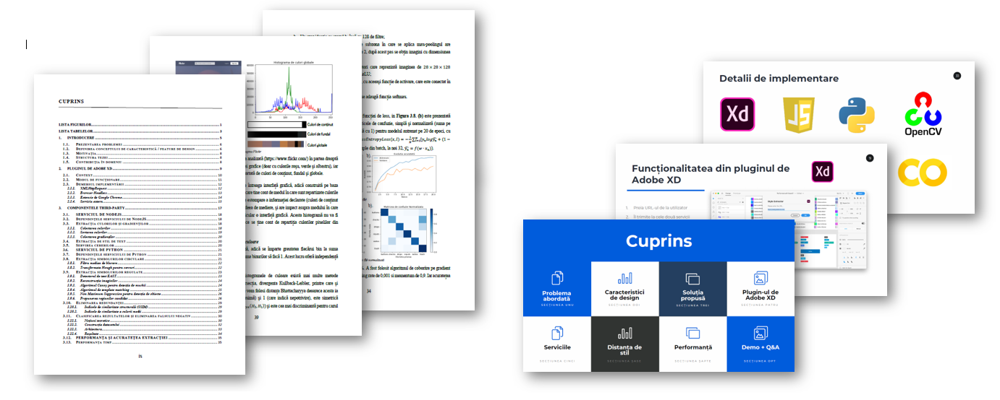

# Undergraduate Thesis
My Bachelor's Thesis project.
> ### Abstract
> This bachelor thesis proposes to automate the process of extracting essential style features from a graphical interface and exposing these features to be used as a basis for construction for a new graphical interface. The utility of such an application is to construct a design on the basis of another so that the new design does not come from scratch but has a starting point, namely the features extracted with the style extractor. 
> 
> In this work, a new concept is introduced, namely the distance between the style of two graphical interfaces, based on the design features extracted with the style extractor. This distance measures the dissimilarity between the style of two graphical interfaces, and for its calculation a number of concepts are used in several areas such as image processing, artificial intelligence, statistics and mathematics.

The  [thesis presentation](https://github.com/marianlupascu/Undergraduate-Thesis/blob/master/Presentation.pdf)  is available, in romanian. For more details, you can consult the  [full-length paper](https://github.com/marianlupascu/Undergraduate-Thesis/blob/master/UndergradThesis.pdf). It is written in romanian, except for a two-page summary written in english.

Code is unavailable to the public as the thesis was developed while working at Adobe.